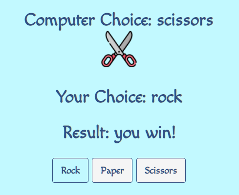
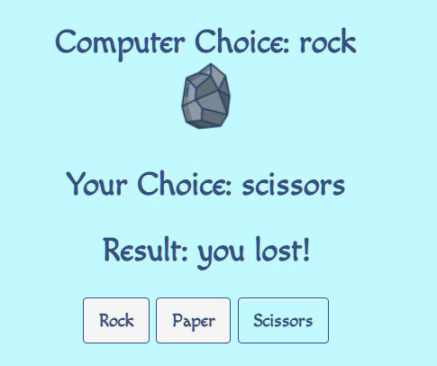

# Rock Paper Scissors Game

#### Rock Paper Scissors (also known by other orderings of the three items, with "rock" sometimes being called "stone", or as Rochambeau, roshambo, or ro-sham-bo)[1][2][3] is a hand game originating from China, usually played between two people, in which each player simultaneously forms one of three shapes with an outstretched hand. These shapes are "rock" (a closed fist), "paper" (a flat hand), and "scissors" (a fist with the index finger and middle finger extended, forming a V). "Scissors" is identical to the two-fingered V sign (also indicating "victory" or "peace") except that it is pointed horizontally instead of being held upright in the air.

## Features

* _Header_

    * Featured at the top of the page, the header shows the game name: Rock, Paper, Scissors along with the three shapes formed by outstretched hand.

* _Game Area_

    * In the game area, the user can see the following: 
        * The Computer's Choice
        * The User's Choice
        * Result of the Game
        * Three buttons for the user to choice from Rock, Paper or Scissors.

    * After the user makes his choice, the computer's random choice will be shown along side an image representing the choice.

    * If the user wins, the result will show "You win!".

    * If the computer wins, the result will show "You lost!"

    
    * In case of a draw, the result will show "It's a draw!"

    

