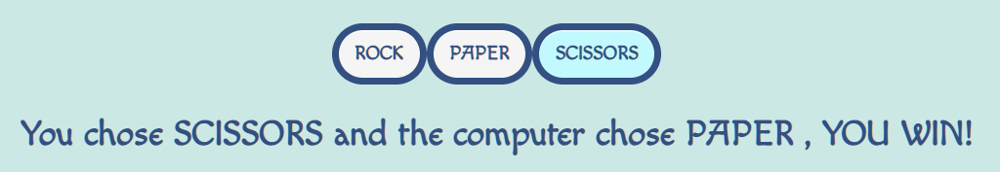
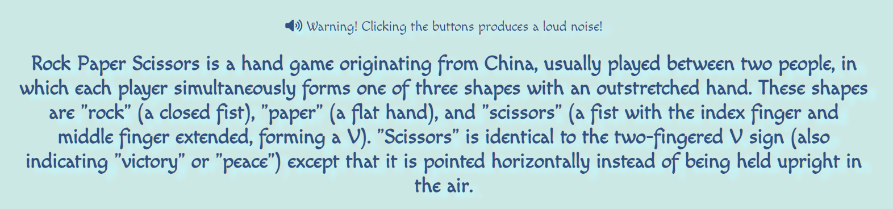

# Rock Paper Scissors Game

 

#### Rock Paper Scissors (also known by other orderings of the three items, with "rock" sometimes being called "stone", or as Rochambeau, roshambo, or ro-sham-bo)[1][2][3] is a hand game originating from China, usually played between two people, in which each player simultaneously forms one of three shapes with an outstretched hand. These shapes are "rock" (a closed fist), "paper" (a flat hand), and "scissors" (a fist with the index finger and middle finger extended, forming a V). "Scissors" is identical to the two-fingered V sign (also indicating "victory" or "peace") except that it is pointed horizontally instead of being held upright in the air.

## Features

* _Header_

    * Featured at the top of the page, the header shows the game name: Rock, Paper, Scissors along with the three shapes formed by outstretched hand.

* _Game Area_

    * In the game area, the user can see the following: 
        * Three buttons for the user to choice from Rock, Paper or Scissors.
        * An image represiting the three buttons.
        * Result of the Game and a coresponding sound after a button was pressed.

    * After the user makes his choice, the computer's random choice will be shown.

    * If the user wins, the result will show "You chose SCISSORS and the computer chose PAPER , YOU WIN!".

    

    * If the computer wins, the result will show "You chose PAPER and the computer chose SCISSORS , YOU LOSE!"

    
    
    * In case of a draw, the result will show "You chose SCISSORS and the computer chose SCISSORS , ITS A DRAW!"

    

* _Info Area_

    * in the info area user will find information about the game, where it is originated from, how many players should play it and the rules of the game.

    

* The Footer

    * The footer is at the bottom of the page containing social media links. All links open in a new tab.

    

## Testing

* I tested playing this game on different browsers and devices - chrome, mozzila, mobile device.

* I confirm that the game result are always correct.

* I confirm that all text is readable and easy to understand, using easy to read fonts and colors and running it through 'lighthouse' in devtools.

### Validator Testing

* HTML
    * No errors were return when passing through the official W3C validator

    

    * No errors were return when passing through the official (Jigsaw) validator

    

## Bugs

* When manual tested the draw function of the game, noticed that the result showed 'undefined'.
* When quickly pressed the button simultanously, game result is 'undefined'.
* Solved both issues by changing the 'if - else' function to 'switch-case'.

## Deployment

* The site was deployed to GitHub pages. The steps to deploy are as follows:
    * In the GitHub repository, navigate to the Settings tab
    * From the source section drop-down menu, select the Master Branch
    * Once the master branch has been selected, the page will be automatically refreshed with a detailed ribbon display to indicate the successful deployment.

The live link can be found here - https://gabrielsiket.github.io/Rock-Paper-Scissors/

## Credits

* Content

    * The text for the Info was taken from https://en.wikipedia.org/wiki/Rock_paper_scissors
    * Instructions on how to implement JavaScrips were taken from https://github.com/kubowania
    * The icons in the footer were taken from Font Awesome

* Media

    * Sounds were taken from https://pixabay.com/ro/
    * Logo image was taken from https://www.pngkey.com/

    

